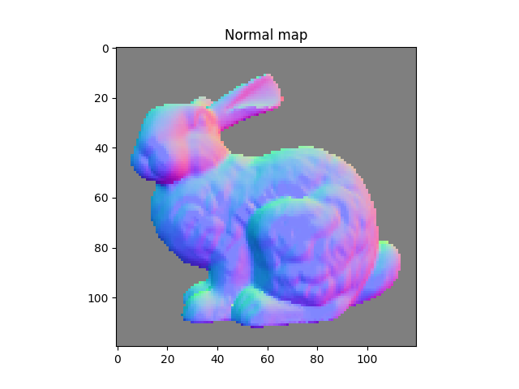
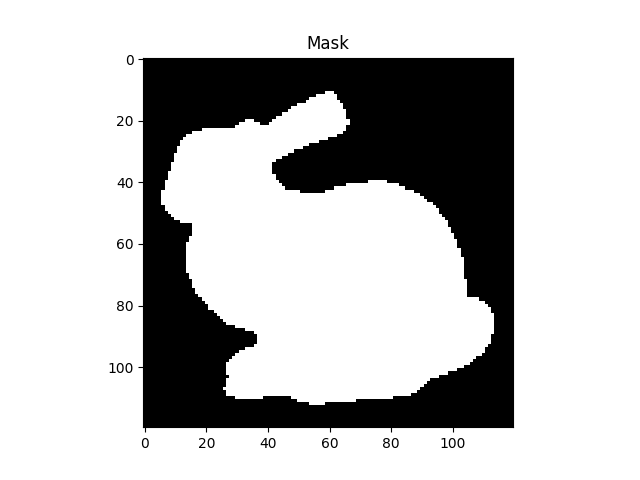
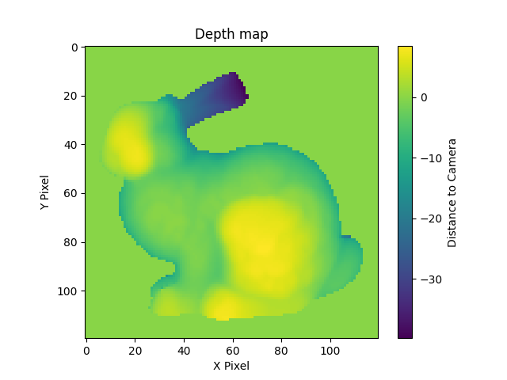
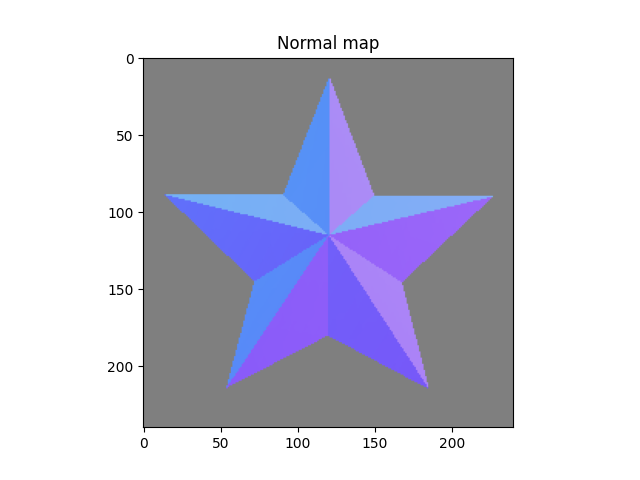
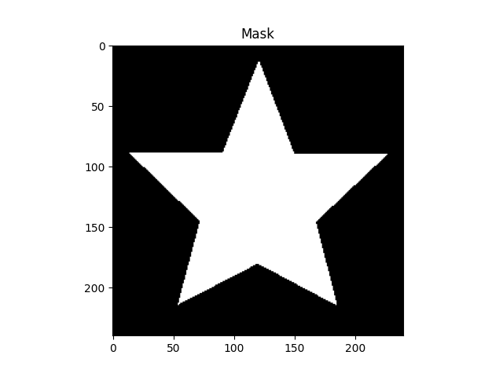
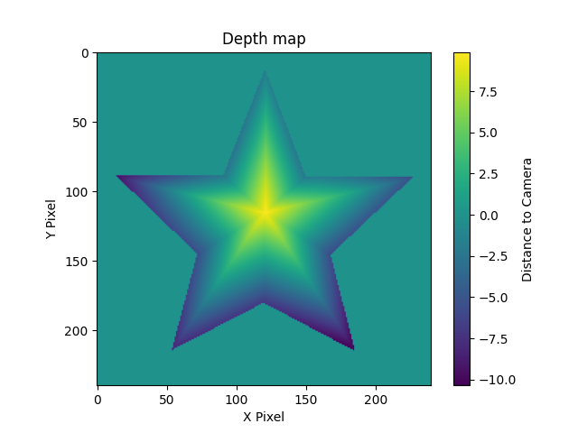
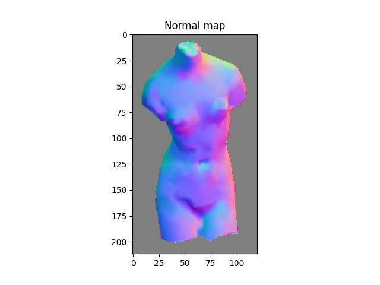
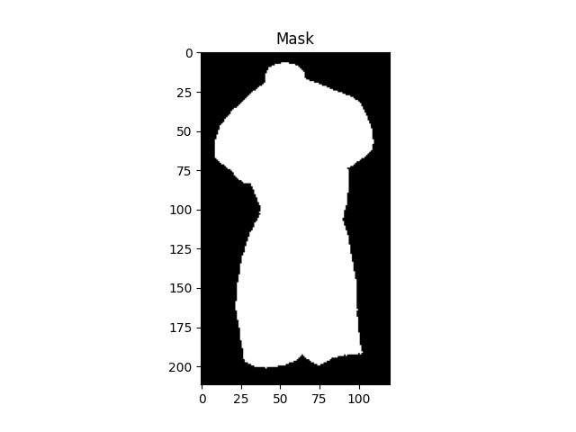
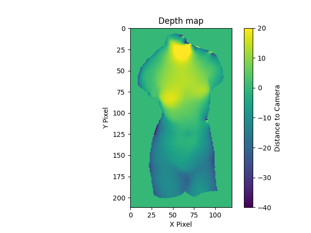

# Photometric Stereo - Shape from Shading
A photometric stereo implementation that reconstructs 3D surface geometry from multiple images taken under different lighting conditions. The system estimates surface normals using multiple illumination directions and recovers depth information through integration, outputting normal maps, depth maps, and 3D point clouds in PLY format.

## Problem Formulation
Given six input images of a static object captured under different lighting conditions and a corresponding text file containing light source parameters, the goal is to reconstruct the 3D surface geometry of the object. This process requires implementing photometric stereo reconstruction to estimate surface normals, depth integration to recover surface heights, and 3D point cloud generation for complete geometric representation. The output consists of a normal map, depth map, and 3D point cloud that accurately represent the object's surface structure.

## Features
- Implements photometric stereo algorithm to reconstruct 3D surface from multiple images under different lighting conditions
- Normal estimation using least squares method with 6 different light source directions
- Depth estimation via surface integration using sparse linear system solving
- Comprehensive visualization tools for normal maps, depth maps, and masks
- Point cloud generation and 3D visualization support
- Robust error handling and logging system

## Processing Pipeline
1. **Normal Estimation**: Computes surface normals from 6 images under different lighting conditions
2. **Mask Generation**: Creates binary mask identifying valid surface regions  
3. **Depth Integration**: Reconstructs 3D surface depth from normal field
4. **Visualization**: Generates normal maps, depth maps, and 3D point clouds

## Input / Output Format
### Input

- **Image Files**: Six grayscale BMP images (pic1.bmp to pic6.bmp), all with identical dimensions.
- **Light Source File**: Each line contains the 3D direction vector of the corresponding light source.
```
pic1: (x1,y1,z1)
pic2: (x2,y2,z2)
pic3: (x3,y3,z3)
pic4: (x4,y4,z4)
pic5: (x5,y5,z5)
pic6: (x6,y6,z6)
```

**Example**
```
pic1: (238,235,2360)
pic2: (298,65,2480)
pic3: (-202,225,2240)
pic4: (-252,115,2310)
pic5: (18,45,2270)
pic6: (-22,295,2230)
```

### Output
- Normal Map: RGB visualization of surface normals. Also saved as `normal_map.png`.
- Mask: Binary mask showing valid reconstruction regions. Also saved as `mask.png`.
- Depth Map: Color-coded depth information with colorbar. Also saved as `depth_map.png`.
- Point Cloud: ASCII format point cloud file with interactive visualization. Also saved as `object_name.ply`.

## Environment:
- OS: Windows 11
- Interpreter: Python 3.10.11
- Required packages: OpenCV, NumPy, Open3D, Matplotlib, SciPy

## Directory Structure
```
HW1/
  ├── photometric_stereo.py     # Main photometric stereo implementation
  ├── testcase                  # 3 Testcase: bunny, star, venus 
  │   └── <object_name>         # Individual object directory
  │       ├── LightSource.txt   # Light direction vectors
  │       ├── pic1~6.bmp        # Image under light source 1~6
  │       ├── normal_map.png    # Visualization of surface normals
  │       ├── mask.png          # Valid pixel mask
  │       ├── depth_map.png     # Reconstructed depth information
  │       └── <object_name>.ply # 3D point cloud file
  └── README.md
```
## Usage Guide
### How to execute
Run the program with
```
python photometric_stereo.py <object_name1> [<object_name2> ...]
```

**Example**
```
python photometric_stereo.py bunny star venus
```

## Experiment

<table>
  <tr>
    <td align="center">
      
      <br><sub>Figure 1a. Normal Map</sub>
    </td>
    <td align="center">
      
      <br><sub>Figure 1b. Mask</sub>
    </td>
    <td align="center">
      
      <br><sub>Figure 1c. Depth Map</sub>
    </td>
  </tr>
</table>

<table>
  <tr>
    <td align="center">
      
      <br><sub>Figure 2a. Normal Map</sub>
    </td>
    <td align="center">
      
      <br><sub>Figure 2b. Mask</sub>
    </td>
    <td align="center">
      
      <br><sub>Figure 2c. Depth Map</sub>
    </td>
  </tr>
</table>

<table>
  <tr>
    <td align="center">
      
      <br><sub>Figure 3a. Normal Map</sub>
    </td>
    <td align="center">
      
      <br><sub>Figure 3b. Mask</sub>
    </td>
    <td align="center">
      
      <br><sub>Figure 3c. Depth Map</sub>
    </td>
  </tr>
</table>
