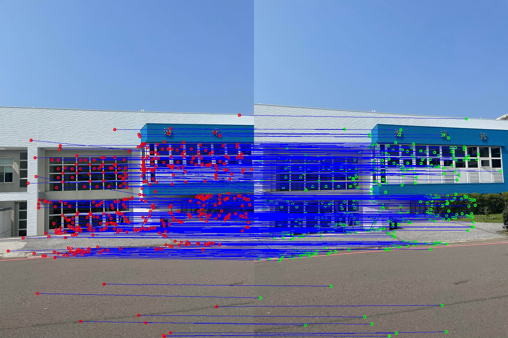
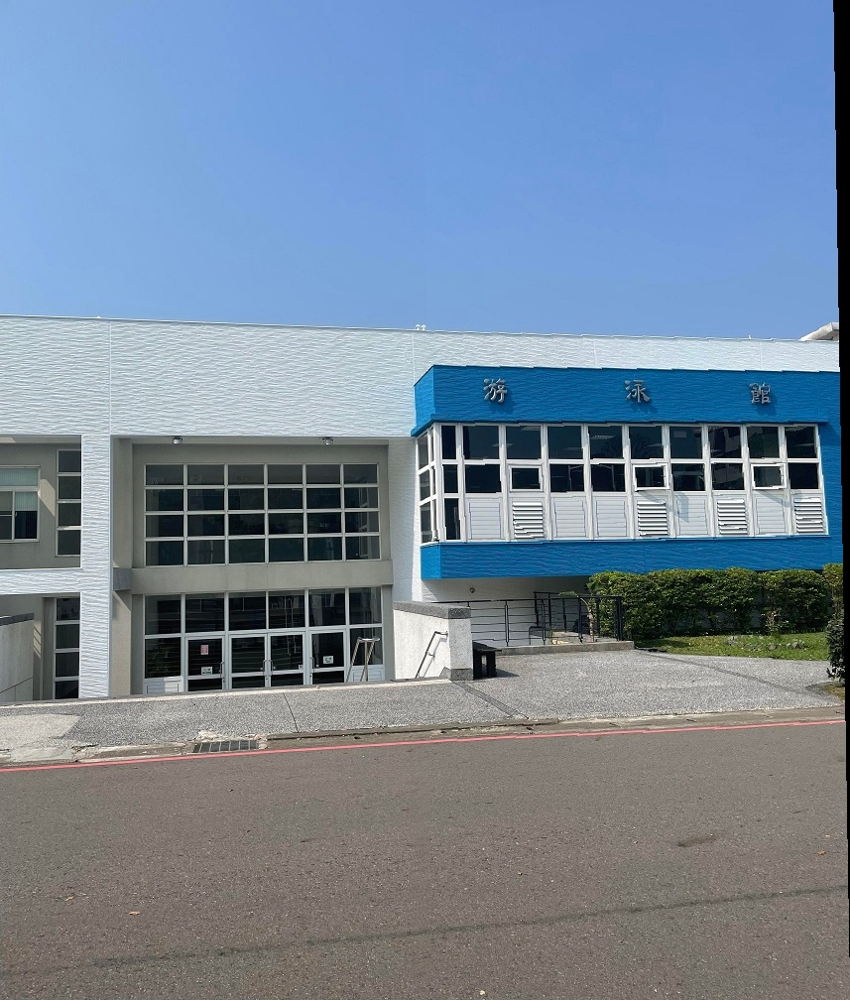
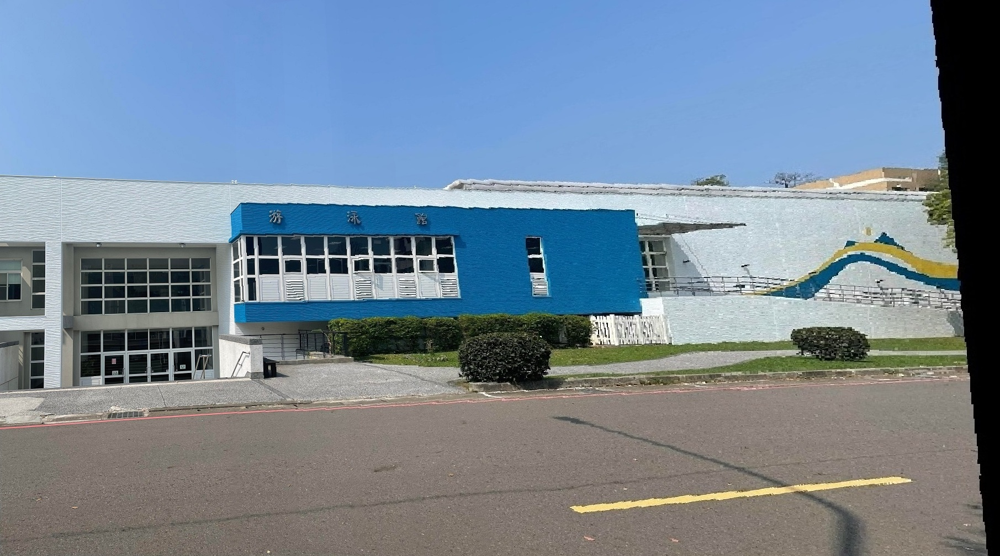

# Image Stitching - Panorama Generation
An automatic image stitching pipeline that combines two overlapping images into a seamless panorama. The implementation uses SIFT feature detection, robust homography estimation via RANSAC, and supports multiple blending modes for smooth transitions between images.

## Problem Formulation
Given two input images with overlapping regions, the goal is to generate a seamless panoramic image that combines both inputs into a single, geometrically consistent view. This process requires implementing a complete pipeline consisting of: SIFT for feature detection and description, KNN matching for establishing correspondences, RANSAC for robust outlier removal, and homography estimation for geometric transformation, ultimately blending the images to create a natural-looking panoramic result.

## Features
- SIFT feature extraction and matching with Lowe's ratio test
- Robust homography estimation using RANSAC algorithm
- Multiple blending modes for seamless panorama generation
- Automatic black border removal and image cropping
- Feature matching visualization
- Robust error handling and logging system

## Processing Pipeline
1.	**Image Loading**: Load two input images and convert them to grayscale and color formats.
2.	**Feature Extraction**: Detect SIFT keypoints and compute descriptors for both images.
3.	**Feature Matching**: Match descriptors using KNN search, then apply Lowe’s ratio test to retain valid matches.
4.	**Homography Estimation**: Use RANSAC to find the best homography matrix. Each iteration samples 4 matches ->Solve DLT -> counts inliers -> keeps the best model.
5.	**Image Warping**: Warp the right image using the estimated homography to align with the left image.
6.	**Blending**: Blend the aligned images using selected blending mode
7.	**Post-processing**: Remove black borders and crop the final stitched image.


## Parameters

### RANSAC Configuration
- **Threshold**: 1.0 pixels (distance for inlier classification)
- **Iterations**: 1000 (maximum RANSAC iterations)
- **Minimum matches**: 4 (required for homography estimation)

### Feature Matching
- **Lowe's ratio**: 0.75 (default threshold for ratio test)
- **SIFT detector**: OpenCV implementation with default parameters

### Blending Parameters
- **Constant width**: 10 pixels (for linearBlendingWithConstant mode)
- **Alpha interpolation**: Linear transition in overlap regions

## Input / Output Format
### Input
**Image Files**: The input should consist of two overlapping images in JPG or PNG format, with sufficient texture to facilitate matching. For optimal results, it is recommended that the images have approximately 20-50% overlap.

### Output
- Input: Two input images are shown side-by-side
- Keypoints & Inliers: Prints `kp` and `matches` to the terminal.
- Feature Matches: Visualizes matched keypoints between the two input images. Also saved as `Feature_Matches.jpg`.
- Homography matrices: Prints the estimated homography matrix and its inverse to the terminal.
- Final Stitching Result: Final panorama with specified blending mode applied. Also saved as `output.jpg`.

## Environment
- OS: Windows 11
- Interpreter: Python 3.10.11
- Required packages: OpenCV, NumPy, Matplotlib, Random

## Directory Structure
```
HW2/
  ├── image_stitching.py  # Main image stitching implementation
  ├── baseline/
  │   └── m1~m6.jpg       # Input image
  ├── bonus/
  │   └── m1~m4.jpg       # Bonus input image
  ├── feature_matches.jpg # Feature matching visualization
  ├── output.jpg          # Output panorama image
  └── README.md
```

## Usage Guide
### How to execute
Run the program with
```
python image_stitching.py <left_img> <right_img> <output_img> --blend <blending_mode>
```

**Blending Modes**
- `noBlending`: Simple overlay without blending
- `linearBlending`: Linear alpha blending in overlap regions
- `linearBlendingWithConstant`: Linear blending with constant width around seam

**Examples**
```
python image_stitching.py baseline/m1.jpg baseline/m2.jpg output.jpg --blend linearBlendingWithConstant
```

## Experiment
<p align="center">
  
</p>
<p align="center">Figure 1. Feature matches between <code>m1.jpg</code> and <code>m2.jpg</code></p>

<p align="center">
  
</p>
<p align="center">Figure 2. Stitched result of <code>m1.jpg</code> and <code>m2.jpg</code></p>

<p align="center">
  
</p>
<p align="center">Figure 3. Final stitched result from <code>m1.jpg</code> to <code>m6.jpg</p>

